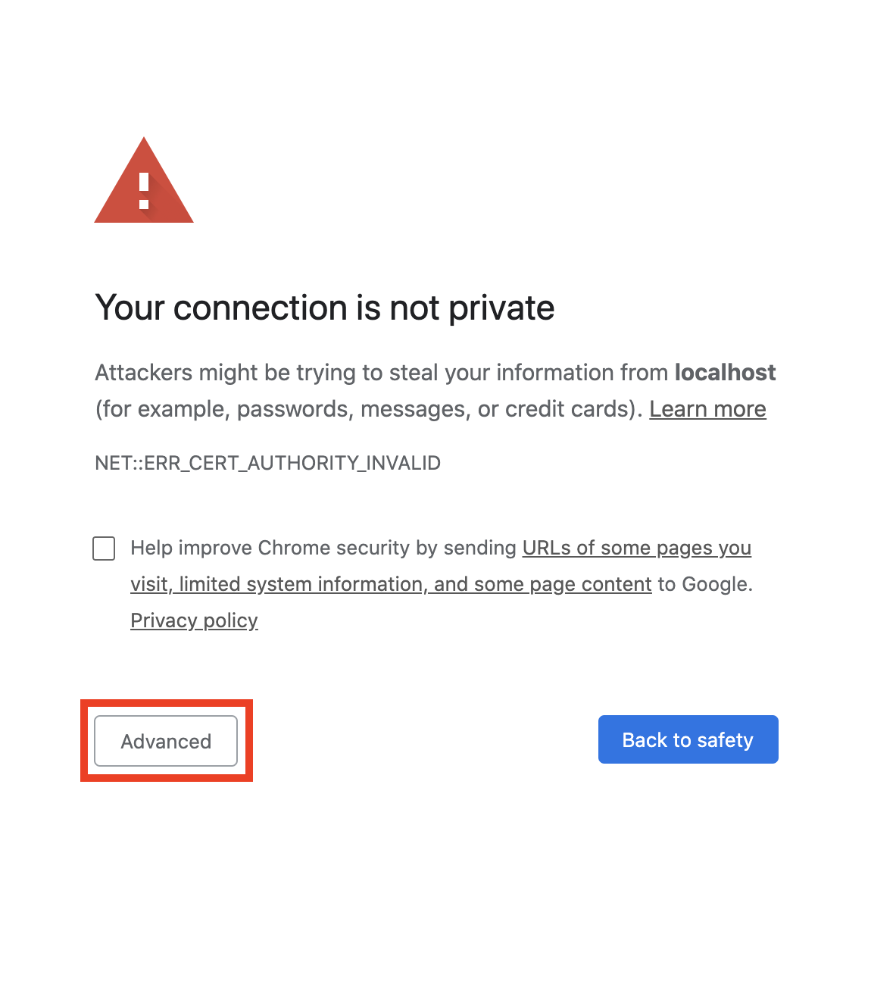
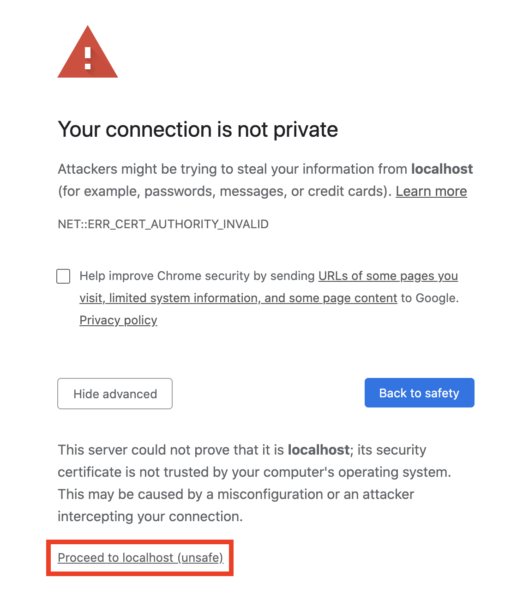
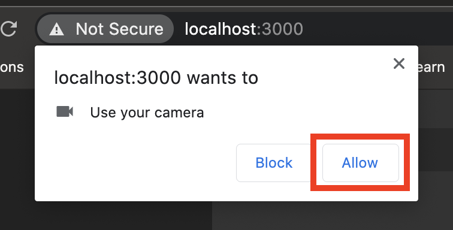
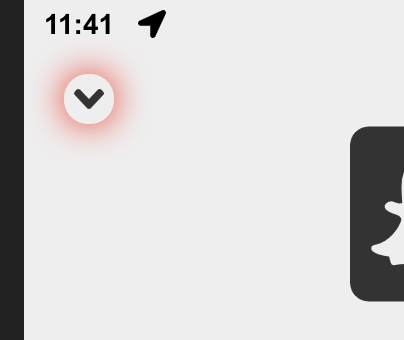
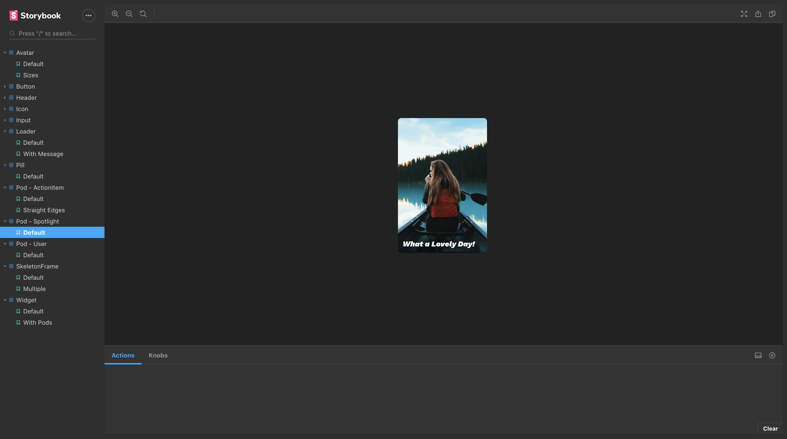
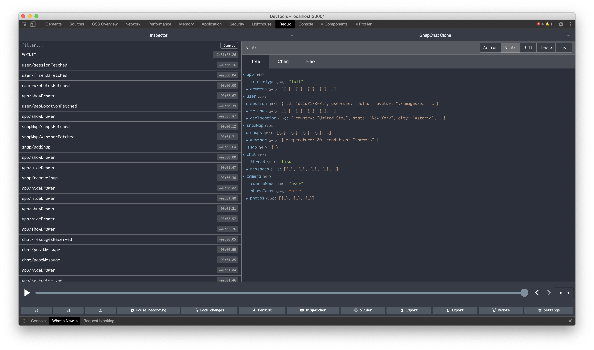
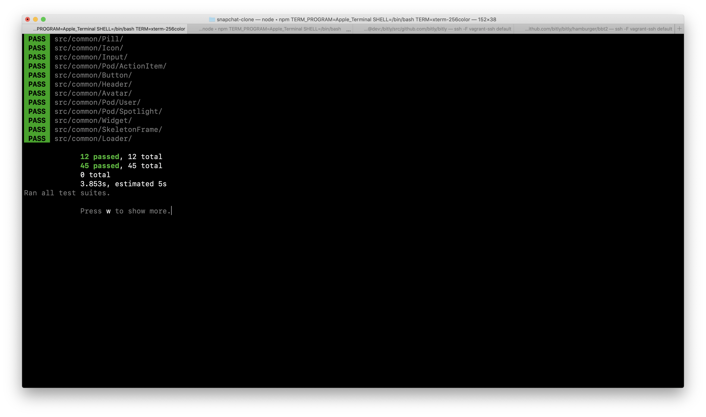

<h1 align="center">👻 SnapChat Clone</h1>

  
  
  
  
  
  
  
  
  
  
  
  

 

<table>
  <tbody>
    <tr>
      <th colspan="2" align="left">
        <h2>⚡️Breakdown</h2>
      </th>
    </tr>
    <tr>
      <td align="center" valign="top">
        
        
👆Click the gif to see all implemented features

      </td>
      <td valign="top">
        <h2 align="center">
          <a
            href="https://towhidkashem.github.io/snapchat-clone/"
            target="_blank"
            >[LIVE DEMO]</a
          >
        </h2>
        <ul>
          <li>
            Built with <code>React</code>
            <ul>
              <li>Only functional components using hooks</li>
              <li>
                Folder structure:
                <ul>
                  <li>Flat - no greater than one level deep</li>
                  <li>
                    Modular - each folder contains all the relevant files needed
                    to make up a particular feature (components, styles, tests,
                    actions, etc). Having everything close at hand reduces
                    cognitive load and deleting a folder removes the feature
                    entirely from the code base without having to worry about
                    left over code
                  </li>
                  <li>
                    Organized semantically by Feature (not by the traditional
                    "components" "containers", etc), this way of reasoning is
                    more human friendly
                  </li>
                  <li>
                    <code>common</code> directory houses all shared components
                  </li>
                </ul>
              </li>
              <li>
                Custom component library showcased in <code>Storybook</code>
              </li>
              <li>Relatively few prod dependencies</li>
            </ul>
          </li>
          <li>
            Global state management via <code>Redux</code>
            <ul>
              <li>
                Follows the <code>ducks</code> proposal to bundle action types,
                creators and reducers all in one file (removing the need to jump
                around)
              </li>
              <li>Flat state tree avoids deeply nested properties</li>
              <li>
                Follows the updated Redux style guide recommendations for naming
                action types
              </li>
              <li>Uses <code>thunk</code> for async operations</li>
              <li>
                Integrates the powerful
                <code>Redux Devtools Extension</code> for ease of development
              </li>
            </ul>
          </li>
          <li>
            Styled with <code>SASS</code>
            <ul>
              <li>
                Each view's set of rules are scoped to a single parent element
                via nesting to avoid style clashes
              </li>
              <li>
                Use of variables, extendables and mixins to keep things DRY and
                uniform
              </li>
            </ul>
          </li>
          <li>
            Written in <code>Typescript</code>
            <ul>
              <li>
                To let the compiler catch bugs at build time instead of letting
                users catch them at runtime!
              </li>
            </ul>
          </li>
          <li>Unit tested with <code>Jest</code> and <code>Enzyme</code></li>
          <li>
            End-to-end tested with <code>Cypress</code>
            <ul>
              <li>
                Selectors use <code>data</code> attributes instead of classes or
                ids as these change often causing tests to break
              </li>
              <li>
                Integration suite covers all essential feature happy paths
              </li>
            </ul>
          </li>
          <li>Linted using <code>Eslint</code></li>
          <li>
            Code is auto formatted using <code>Prettier</code> (ran as a
            pre-commit git hook) before it gets pushed to the repo
          </li>
          <li>
            Feels close to a native app if you "add to homescreen" on mobile
          </li>
        </ul>
        <h2 align="center">
          <a
            href="https://towhidkashem.github.io/snapchat-clone/"
            target="_blank"
            >[LIVE DEMO]</a
          >
        </h2>
      </td>
    </tr>
  </tbody>
</table>

<h2>💿 Installation</h2>

Run these commands in the terminal:

<ol>
  <li>
    <code>$ git clone git@github.com:TowhidKashem/snapchat-clone.git</code>
  </li>
  <li><code>$ cd snapchat-clone</code></li>
  <li>
    <code>$ npm install</code>
    <ul>
      <li>
        This will:
        <ul>
          <li>Install the dependencies in package.json</li>
          <li>
            Checkout
            <a
              href="https://github.com/jeeliz/jeelizFaceFilter_"
              target="_blank"
              >jeelizFaceFilter</a
            >
            package (used for the filters) and set it to the last version this
            project was tested and confirmed to work with
          </li>
          <li>
            Run <code>gulp</code> to concatenate, minify and transpile the files
            located in <code>public/filters/source/*.js</code> into a single
            file called <code>filters.min.js</code>
          </li>
        </ul>
      </li>
    </ul>
  </li>
  <li>
    This part is optional but strongly recommended, without it you won't be able
    to view any of the snap map features:
    <ul>
      <li>
        Make a Mapbox account and
        <a
          href="https://docs.mapbox.com/help/glossary/access-token/"
          target="_blank"
          >get a free API key</a
        >
      </li>
      <li>
        Rename the <code>.env.sample</code> file at the root of the project to
        just <code>.env</code>
      </li>
      <li>
        Inside enter your new API key, for example:
        <ul>
          <li>
            Before:
            <code>REACT_APP_MAP_BOX_API_KEY=&lt;REPLACE_WITH_API_KEY&gt;</code>
          </li>
          <li>After: <code>REACT_APP_MAP_BOX_API_KEY=xy.abc123</code></li>
        </ul>
      </li>
    </ul>
  </li>
  <li>
    <code>$ npm start</code>
    <ul>
      <li>
        The app should open automatically in your browser usually at
        <code>https://localhost:3000/</code>
        <ul>
          <li>
            In Chrome you will receive a "Your connection is not private"
            warning
            <ul>
              <li>
                Click "Advanced" &gt; "Proceed to localhost (unsafe)"
                <ul>
                  <li>
                    You'll get this warning because the app uses a self signed
                    <code>https</code> certificate. The
                    <code>getUserMedia</code> API used by the camera requires
                    the <code>https</code> protocol so we run the dev server in
                    https mode.
                  </li>
                </ul>
              </li>
            </ul>
          </li>
          <li>
            After this you will be prompted to give access to your webcam, click
            "Allow"
          </li>
        </ul>
      </li>
    </ul>
     
    <table>
      <tbody>
        <tr>
          <th align="center">
            Step 1
          </th>
          <th align="center">
            Step 2
          </th>
          <th align="center">
            Step 3
          </th>
        </tr>
        <tr>
          <td align="center" valign="middle">
            
          </td>
          <td align="center" valign="middle">
            
          </td>
          <td align="center" valign="middle">
            
          </td>
        </tr>
      </tbody>
    </table>
  </li>
  <li>You're all set! 🎉</li>
</ol>

<table>
  <tbody>
    <tr>
      <th colspan="2" align="left">
        <h2>🦮 Guides</h2>
      </th>
    </tr>
    <tr>
      <td align="center" valign="top">
        
      </td>
      <td valign="top">
        Not all the buttons are actionable, many of them are there just for show
        since this is a minimal demo. This
        <a href="" target="_blank">video</a> shows all the things you can
        currently do. Where it's not obvious which buttons actually work I added
        red box-shadows as guides.
      </td>
    </tr>
  </tbody>
</table>

<table>
  <tbody>
    <tr>
      <th colspan="2" align="left">
        <h2>🛠 Tooling</h2>
      </th>
    </tr>
    <tr>
      <td valign="top">
        
        

          <strong>Storybook</strong> is used to showcase the app's custom
          component library. You can run Storybook using the command
          <code>npm run storybook</code>
        

      </td>
      <td valign="top">
        
        

          <strong>Redux Devtools Extension</strong> is implemented in the app,
          it makes things like viewing the state tree, state flow and debugging
          much easier, to use it you need to install the browser extension
          <a
            href="https://chrome.google.com/webstore/detail/redux-devtools/lmhkpmbekcpmknklioeibfkpmmfibljd?hl=en"
            target="_blank"
            >here</a
          >
          or
          <a
            href="https://addons.mozilla.org/en-US/firefox/addon/reduxdevtools/"
            target="_blank"
            >here</a
          >.
        

      </td>
    </tr>
  </tbody>
</table>

<h2>🧪 Testing</h2>

<table>
  <tbody>
    <tr>
      <th colspan="2" align="left">
        <strong>End-to-End Tests</strong>
      </th>
    </tr>
    <tr>
      <td align="center" valign="top">
        
        
👆Click to see the tests run

      </td>
      <td valign="top">
        <ul>
          <li>
            All e2e tests are located in
            <code>cypress/integration/*.spec.ts</code>
            <ul>
              <li>
                To run these first make sure the dev server is up and running
                via <code>npm start</code>, then use the command
                <code>npm run e2e</code>
              </li>
              <li>
                This will open the Cypress electron app. Click "Run all specs"
                at the top right, you'll then get a Chrome instance and see all
                the tests being run
              </li>
            </ul>
          </li>
          <li>
            Alternatively you can run the test suite in the terminal using the
            command <code>npm run e2e-headless</code>. This command still
            generates videos in <code>cypress/videos/*.mp4</code> of the tests
            should you need them.
          </li>
        </ul>
      </td>
    </tr>
  </tbody>
</table>

<table>
  <tbody>
    <tr>
      <th colspan="2" align="left">
        <strong>Unit Tests</strong>
      </th>
    </tr>
    <tr>
      <td valign="top">
        
      </td>
      <td valign="top">
        <ul>
          <li>
            All the shared components in the <code>common</code> directory have
            unit tests inside their respective folders. They end with a
            <code>*.test.tsx</code> extension.
          </li>
          <li>
            To run the unit test suite use the command
            <code>npm run test</code>
          </li>
          <li>
            These tests are also automatically run on each commit, if there are
            any failures the commit will also fail
          </li>
        </ul>
      </td>
    </tr>
  </tbody>
</table>

<h2>📝 Misc Notes</h2>

<ul>
  <li>
    If you want to make changes to the filter files located in
    <code>public/filters/src/*.js</code>, run the command
    <code>npm run gulp watchJS</code> so that your changes get picked up
  </li>
  <li>
    The project's <code>baseUrl</code> is set to the <code>src</code> directory
    in tsconfig so you can use clean import paths like
    <code>import Foo from 'common/Foo';</code> instead of messy ones like
    <code>import Foo from '../../common/Foo';</code>. You can also use these in
    the SASS files, e.g. <code>@import '~styles/foo`;</code>
  </li>
  <li>
    This is a purely front end demo, the "API" is nothing but a bunch of json
    files with hard coded dummy data, they're located in
    <code>/public/api/*.json</code>
  </li>
</ul>

<h2>⚠️ Contributing</h2>

  Please note I won't be accepting PR's on this project since it's part of my
  personal portfolio. You're more than welcome to fork and maintain your own
  version if you like!

<h2>⚖️ License</h2>

  The Snapchat name, artwork, trademark are all property of Snap Inc. This
  project is provided for educational purposes only. It is not affiliated with
  and has not been approved by Snap Inc.

