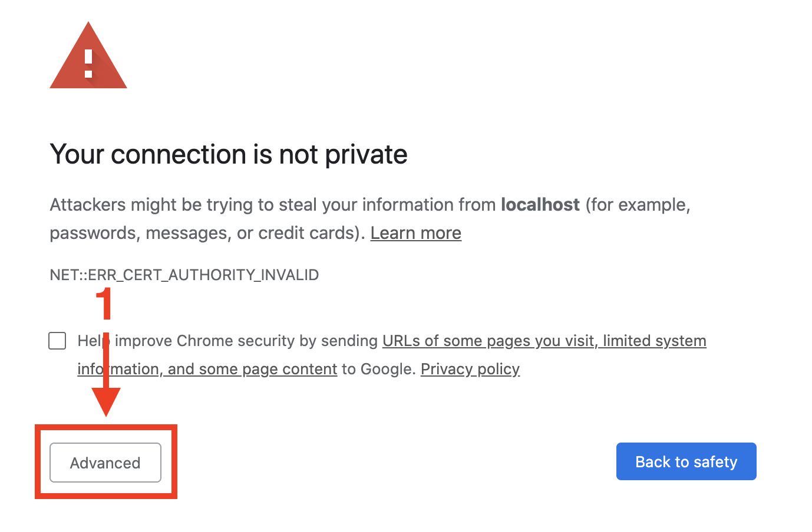
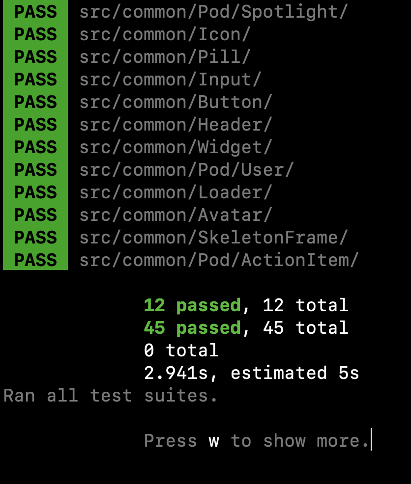

<h1 align="center">👻 SnapChat Clone</h1>

  
  
  
  
  
  
    
  
  
  
  
  

 

<table>
  <tbody>
    <tr>
      <th colspan="2" align="left">
        <h2>⚡️Breakdown</h2>
      </th>
    </tr>
    <tr>
      <td align="center" valign="top">
        <a href="public/github/snapchat.mp4">
          
          
👆Click to see all implemented features

        </a>
      </td>
      <td valign="top">
        <h2 align="center">
          <a href="https://google.com">[LIVE DEMO]</a>
        </h2>
        <ul>
          <li>
            Built with <code>React</code>
            <ul>
              <li>Functional components using hooks</li>
              <li>Feature based folder structure</li>
              <li><code>common</code> directory for shared components</li>
              <li>Relatively few prod dependencies</li>
            </ul>
          </li>
          <li>
            Global state management via <code>Redux</code>
            <ul>
              <li>
                Follows the modular ducks proposal to bundle action types,
                creators and reducers all in one file (reducing need to jump
                around)
              </li>
              <li>Flat state tree (avoids deeply nested properties)</li>
              <li>
                Follows official Redux styleguide recomendations for naming
                actions and action types
              </li>
              <li>Uses <code>thunk</code> middleware for async operations</li>
            </ul>
          </li>
          <li>Styled with <code>SASS</code></li>
          <li>Type checked with <code>Typescript</code></li>
          <li>Unit tested with <code>Jest</code> and <code>Enzyme</code></li>
          <li>
            End-to-end tested with <code>Cypress</code>
            <ul>
              <li>
                Selectors use <code>data-*</code> attributes to avoid writing
                brittle tests
              </li>
              <li>Integration suite covers all functionality</li>
            </ul>
          </li>
          <li>Custom component library showcased in <code>Storybook</code></li>
          <li>Linted using <code>Eslint</code></li>
          <li>
            Code is auto formatted using <code>Prettier</code> (ran as a
            pre-commit git hook) before it gets pushed to the repo
          </li>
          <li>
            Feels close to a native app if you "add to homescreen" on mobile
          </li>
        </ul>
      </td>
    </tr>
  </tbody>
</table>

<h2>💿 Installation</h2>

Run these commands in the terminal:

<ol>
  <li>
    <code>&gt; git clone git@github.com:TowhidKashem/snapchat-clone.git</code>
  </li>
  <li><code>&gt; cd snapchat-clone</code></li>
  <li>
    <code>&gt; npm install</code>
    <ul>
      <li>
        This will:
        <ul>
          <li>Install the dependencies in package.json</li>
          <li>
            Checkout
            <a href="https://github.com/jeeliz/jeelizFaceFilter_"
              >jeelizFaceFilter</a
            >
            package (used for the filters) and set it to the last version this
            project was tested and confirmed to work with
          </li>
          <li>
            Run <code>gulp</code> to concatenate, minify and transpile the files
            located in <code>public/filters/source/*.js</code> into a single
            file called <code>filters.min.js</code>
          </li>
        </ul>
      </li>
    </ul>
  </li>
  <li>
    This part is optional but strongly recomended, without it you won't be able
    to view any of the snap map features:
    <ul>
      <li>
        Make a Mapbox account and
        <a
          href="https://docs.mapbox.com/help/glossary/access-token/"
          rel="nofollow"
          >get a free API key</a
        >
      </li>
      <li>
        Rename the <code>.env.sample</code> file at the root of the project to
        just <code>.env</code>
      </li>
      <li>
        Inside enter your new API key, for example:
        <ul>
          <li>
            Before:
            <code>REACT_APP_MAP_BOX_API_KEY=&lt;REPLACE_WITH_API_KEY&gt;</code>
          </li>
          <li>After: <code>REACT_APP_MAP_BOX_API_KEY=xy.abc123</code></li>
        </ul>
      </li>
    </ul>
  </li>
  <li>
    <code>&gt; npm start</code>
    <ul>
      <li>
        The app should open automatically in your browser at
        <code>https://localhost:3000/</code>
        <ul>
          <li>
            In Chrome you will receive a "Your connection is not private" error
            <ul>
              <li>
                Click "Advanced" &gt; "Proceed to localhost (unsafe)"
                <ul>
                  <li>
                    You'll get this warning because the app uses a self signed
                    <code>https</code> certificate. The
                    <code>getUserMedia</code> API used by the camera requires
                    the <code>https</code> protocol so we run the dev server in
                    https mode.
                  </li>
                </ul>
              </li>
            </ul>
          </li>
          <li>
            After this you will be prompted to give access to your webcam, click
            "Allow"
          </li>
        </ul>
      </li>
    </ul>
     
    <table>
      <tbody>
        <tr>
          <th align="center">
            Step 1
          </th>
          <th align="center">
            Step 2
          </th>
          <th align="center">
            Step 3
          </th>
        </tr>
        <tr>
          <td align="center" valign="middle">
            
          </td>
          <td align="center" valign="middle">
            
          </td>
          <td align="center" valign="middle">
            
          </td>
        </tr>
      </tbody>
    </table>
  </li>
  <li>You're all set! 🎉</li>
</ol>

<table>
  <tbody>
    <tr>
      <th colspan="2" align="left">
        <h2>🦮 Guides</h2>
      </th>
    </tr>
    <tr>
      <td align="center" valign="top">
        
      </td>
      <td valign="top">
        Not all the buttons are actionable, many of them are there just for show
        since this is a minimal demo. This <a href="">video</a> shows all the
        things you can currently do. Where it's not obvious which buttons
        actually work I added a red box-shadow as guide.
      </td>
    </tr>
  </tbody>
</table>

<table>
  <tbody>
    <tr>
      <th colspan="2" align="left">
        <h2>🛠 Tooling</h2>
      </th>
    </tr>
    <tr>
      <td valign="top">
        
        

          <strong>Storybook</strong> is used to showcase the app's custom
          component library. You can run Storybook using the command
          <code>npm run storybook</code>.
        

      </td>
      <td valign="top">
        
        

          <strong>Redux Devtools Extension</strong> is implemented in the app,
          it makes things like viewing the state, state flow and debugging much
          easier, to use it you need to install the browser extension
          <a
            href="https://chrome.google.com/webstore/detail/redux-devtools/lmhkpmbekcpmknklioeibfkpmmfibljd?hl=en"
            target="_blank"
            >here</a
          >
          or
          <a
            href="https://addons.mozilla.org/en-US/firefox/addon/reduxdevtools/"
            target="_blank"
            >here</a
          >
          .
        

      </td>
    </tr>
  </tbody>
</table>

<h2>🧪 Testing</h2>

<table>
  <tbody>
    <tr>
      <th colspan="2" align="left">
        <h2>End-to-End Tests</h2>
      </th>
    </tr>
    <tr>
      <td align="center" valign="top">
        <a href="">
          
          👆Click to see the entire test suite being run
        </a>
      </td>
      <td valign="top">
        <ul>
          <li>
            All e2e tests are located in
            <code>cypress/integration/*.spec.ts</code>
            <ul>
              <li>To run these use the command <code>npm run e2e</code></li>
              <li>This will spawn the Cypress electron app</li>
              <li>
                Click "Run all specs", Cypress will spawn a Chrome instance and
                you will see all the tests as they're being run:
              </li>
            </ul>
          </li>
          <li>
            Alternatively you can also run the e2e suite in the terminal using
            the command <code>npm run e2e-headless</code>. This command still
            generates videos in <code>cypress/videos/*.mp4</code> of the tests
            being run should you need them.
          </li>
        </ul>
      </td>
    </tr>
  </tbody>
</table>

<table>
  <tbody>
    <tr>
      <th colspan="2" align="left">
        <h2>Unit Tests</h2>
      </th>
    </tr>
    <tr>
      <td valign="top">
        
      </td>
      <td valign="top">
        <ul>
          <li>
            All the shared components in the <code>common</code> directory have
            unit tests inside their respective folders. They end with a
            <code>*.test.tsx</code> extension.
          </li>
          <li>
            To run the unit test suite use the command
            <code>npm run test</code> then enter <code>a</code> to run all tests
          </li>
          <li>
            These tests are also automatically run on each commit, if there are
            any failures the commit will also fail
          </li>
        </ul>
      </td>
    </tr>
  </tbody>
</table>

<h2>📝 Misc Notes</h2>

<ul>
  <li>
    In addition to running on the localhost domain the app is also available on
    your network at <code>https://192.168.0.185:3000</code> (useful for viewing
    on mobile)
  </li>
  <li>
    If you want to make changes to the filter files, run the command
    <code>cd filters &amp;&amp; gulp watchJS</code> to watch for changes
  </li>
  <li>
    If you want to browse the production build run the commands
    <code>npm run build &amp;&amp; npm run serve</code>, then navigate to
    <code>http://localhost:5000</code> locally or
    <code>http://192.168.0.185:5000</code> on the network
  </li>
  <li>
    The <code>baseUrl</code> is set to the <code>src</code> directory in tsconfig which means you can use clean
    import paths like <code>import Foo from 'common/Foo'</code> instead of messy
    relative paths like <code>import Foo from '../../common/Foo'</code>
  </li>
  <li>
    The project was bootsraped using
    <code>Create React App</code>
    in case you were wondering where webpack configs and such are. You can
    always <code>eject</code> if you need access to those things..
  </li>
  <li>
    This is purely a front end demo project, the "api" is nothing but a bunch of
    hard coded json files located in <code>/public/api/*.json</code>. All data
    is dummy data!
  </li>
</ul>

<h2>⚠️ Contributing</h2>

  Please note
  <strong><ins>I will not be accepting PR's on this project</ins></strong> since
  it is part of my personal portfolio. You're more than welcome to fork and
  maintain your own version if you like!

<h2>⚖️ License</h2>

<a href="https://opensource.org/licenses/MIT" rel="nofollow">MIT</a>

