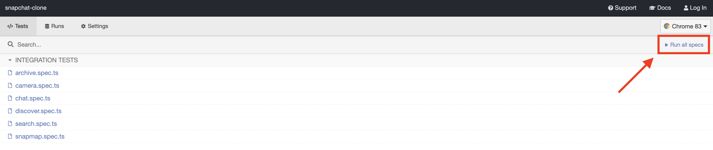

<h1 align="center">👻 SnapChat clone</h1>

## Breakdown

- Built with `React`
  - Functional components using hooks
  - Feature based folder structure
  - `common` directory for shared components
  - Bootstraped using Create React App
- Global state management via `Redux`
  - Follows the modular `ducks` proposal to bundle action types, creators and reducers all in one file
  - Flat state tree (avoids deeply nested properties)
  - Follows official Redux styleguide recomendations for naming actions and action types, e.g. `camera/photosFetched` vs `SET_PHOTOS`
  - Uses `thunk` middleware for async operations
- Type checked with `Typescript`
- Unit tested with `Jest` and `Enzyme`
- End-to-end tested in `Cypress`
- Custom component library showcased in `Storybook`

## Installation

Run these commands in the terminal:

- `> git clone git@github.com:TowhidKashem/snapchat-clone.git`
- `> cd snapchat-clone`
- `> npm install`
  - This will:
    - Install the dependencies in package.json
    - Checkout `jeelizFaceFilter` package (used for filters) and set it to the last version this project was tested and confirmed to work with
    - Run `gulp` to concatenate, minify and transpile the files located in `public/filters/source/*.js` into a single file called `filters.min.js`
- `> npm start`
  - The app should open automatically in your browser at `https://localhost:3000/`
    - In Chrome you will receive a "Your connection is not private" error
      - Click "Advanced" > "Proceed to localhost (unsafe)"

You'll get this warning because the app uses a self signed `https` certificate. The `getUserMedia` API used by the camera requires the `https` protocol so we run the dev server in https mode.

## Full feature walkthrough

## 🧪 Testing

There are two types of tests in the app (end to end and unit).

## End to end tests:

- All e2e tests are located in `cypress/integration/*.spec.ts`
  - These tests use `Cypress`
  - To run these tests run the command `npm run e2e`
    - This will spawn the Cypress electron app
    - Click "Run all specs", Cypress will spawn a Chrome instance and you will see all the tests as they're being run:

## Unit tests:

- All the shared components in the `common` directory have unit tests inside the component folders. They end with a `*.test.tsx` extension.
  - These unit tests use `Jest` and `Enzyme`
  - To run unit tests at any time run the command `npm run test` then type `a` to run all tests
    - These tests are also automatically run on each commit, if there are any failures the commit will also fail
